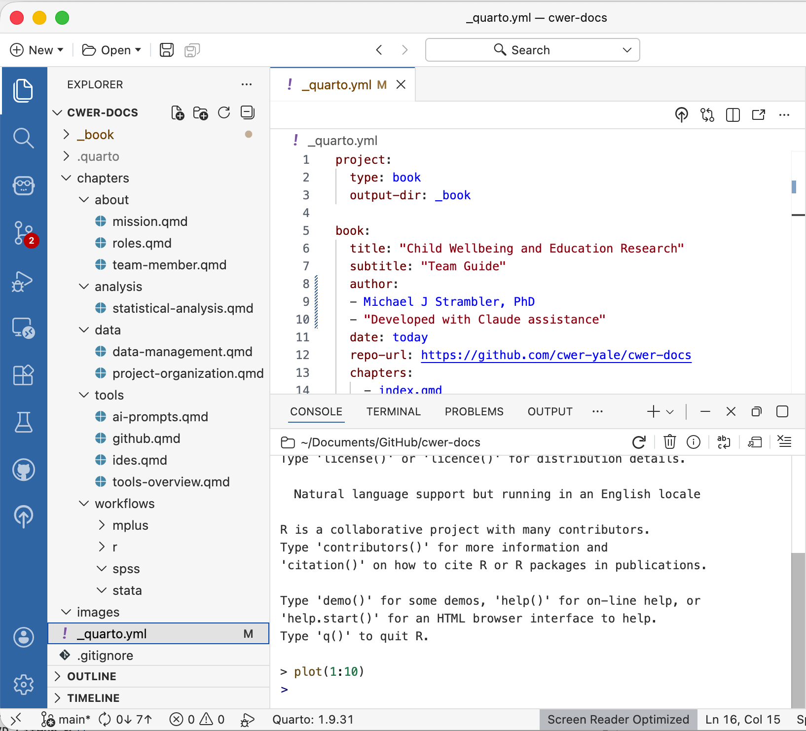

# Project Organization

A well-organized project should answer basic questions through its structure alone. Where did the data come from? Which is the most current presentation file? Is this analysis current? And it should be able to do this without requiring anyone to read code or ask someone who was there. This chapter describes the folder conventions we use across CWER projects. Setting up a new project takes only a few minutes, but the payoff in clarity and reproducibility is substantial.

We use two types of organizational structures. One is for **standard** non-coding files. This is for files like literature, manuscripts, grant proposals, and so on. This will be the most commonly accessed structure. The other structure is for **technical** files that involve coding and data analysis. 

## Standard Organization

Use the following conventions for all non-coding folders and files stored on OneDrive or other shared drives.

### The Short Version

- Folders and files: Title Case with spaces
- Dates: Always YYYY-MM-DD at the start
- Versions: v1, v2, v3 at the end
- No special characters: & # % @ $

### Folders

Use Title Case with spaces. Keep names short and descriptive.
```
SEL Adverse Effects Project/
├── Raw Data/
├── Manuscripts/
│   ├── Prevention Science Journal/
│   └── SEL Journal/
├── Presentations/
│   ├── SREE/
│   └── AERA/
├── Meeting Notes/
├── IRB/
└── Grant Materials/
```

### Files

**Documents with dates** (meeting notes, memos, correspondence) — Format: `YYYY-MM-DD Description.ext`

We use this date format so that files can easily sort chronologically. Although it's possible to sort files by the "Date Added" column in a folder, the metadata used for this can easily be lost or changed. Placing the date in the beginning of the name works much better. That being said, not all files need dates, so only use dates as needed.   

```
2026-03-15 CWER Team Meeting Notes.docx
2026-01-20 PEER Partner Update.docx
2026-02-01 IRB Amendment Submission.pdf
```
**Data files** — Format: `YYYY-MM-DD Description.ext` or `ProjectName Description YYYY-MM-DD.ext`
```
2026-03-01 SEL Adverse Effects Cleaned Data.xlsx
PEER 2025-2026 Teacher Survey Data.sav
```
**Presentations** — Format: `YYYY-MM-DD Event or Audience Description.ext`
```
2026-04-10 AERA SEL Meta-Analysis Slides.pptx
2026-03-15 PEER Partner Dashboard Presentation.pptx
```

### Version Control for Collaborative Documents

Sometimes you may want to indicate the version of a file, especially when collaborating with others. OneDrive does have version control and this is useful as a backup, but it's good practice to not rely on this entirely for versioning. OneDrive has version limits, and it's not so easy to compare documents of different versions. When you have a substantial change that you want to indicate as a new version here are some rules to follow:

1. Use `v#` suffix for versioning: `File Name v3` 
2. Never save over someone else's version
3. Add your initials when returning edits: `File Name v3 MS`
4. The lead author consolidates edits and advances the version number: `v4`
5. Mark the final submitted version clearly: `File Name v5 FINAL SUBMITTED`
6. After submission, archive older versions in a subfolder called `Previous Versions/`

### What to Avoid

| Avoid | Use Instead |
|---|---|
| `final_FINAL_v2_forreal.docx` | `Manuscript v4 FINAL SUBMITTED.docx` |
| `March 15 meeting.docx` | `2026-03-15 Team Meeting Notes.docx` |
| `MSmeetingnotes3-15.docx` | `2026-03-15 Team Meeting Notes.docx` |
| `SEL&EdReport.docx` | `SEL and Ed Report.docx` |
| `data (copy) (2).xlsx` | `Data v2.xlsx` |

## Technical Coding Organization
### The Core Principle

For technical organization, every project has two types of files, and keeping them separate is the foundation of everything else:

1. **Input files are fixed.** Data that comes from outside the project such as partner-provided files, downloaded datasets, or exported survey data, goes in `data/raw/` and is never modified by your scripts. If you need a cleaned version, your script reads the original, transforms it, and saves the result to `data/cleaned/`.

2. **Outputs are reproducible.** Everything your scripts produce such as figures, tables, and rendered reports goes in `output/` and can always be regenerated by rerunning the script that created it. Because of this, they are not committed to GitHub.

When you know that everything in `data/raw/` is an original, untouched input, you can always trust it as the ground truth for the project.

### Technical Project Structure

A typical CWER project looks like this:
```
my-project/
├── data/                   # All data files
│   ├── raw/                # Original inputs — scripts never modify these
│   ├── cleaned/            # Processed data produced by cleaning scripts
│   └── README.md           # Documents where each raw file came from
├── code/                   # Analysis scripts (.qmd, .do, .R, .inp)
│   └── exploratory/        # One-off analyses and sanity checks
├── output/                 # All generated outputs
│   ├── tables/             # Tables (.docx, .xlsx, .csv)
│   └── figures/            # Figures (.png, .pdf)
├── docs/                   # Reports, presentations, manuscripts
└── README.md               # Project overview
```
{fig-align="center" width="60%"}

Not every project needs every subfolder. Adapt as needed, but keep the core separation between `data/raw/` and everything else intact.

### The data/ Folder

#### data/raw/

The `data/raw/` folder holds files that come from **outside** the project — things your scripts read but never modify. This includes:

- Survey data exported from Qualtrics or a partner system
- Data received from school districts or community partners
- Publicly available datasets downloaded from external sources
- Codebooks and metadata provided by partners

Treat everything in `data/raw/` as read-only. Scripts read from it but never write to it. If a raw file needs to be corrected, replace it and document the change in `data/README.md`. Do not silently overwrite it.

#### data/cleaned/

The `data/cleaned/` folder holds processed versions of raw data produced by your cleaning scripts. These are intermediate files that other scripts will use as inputs, such as merged datasets, recoded variables, reshaped files, and so on. Because cleaned files are generated by code, they can always be recreated by rerunning the cleaning script.

#### data/README.md

**Always include a `data/README.md`** that documents where each raw file came from, when it was received, and any relevant notes. This takes two minutes to write and is invaluable six months later when you are trying to remember which version of a dataset came from which partner, or which Qualtrics export corresponds to which wave of data collection.

Example `data/README.md`:
```
# Data Sources

## raw/care4kids_survey_wave1.csv
- Source: CT Office of Early Childhood, received from Jane Smith via Yale OneDrive File Transfer
- Received: 2025-09-15
- Notes: Wave 1 only (fall 2025). N=342. Includes provider ID but no names.

## raw/sel_codebook_v3.xlsx
- Source: Internal; developed by CWER team
- Last updated: 2025-08-01
- Notes: Version 3 adds items from the revised teacher observation protocol
```

### The code/ Folder

Analysis scripts are numbered to reflect the order of the pipeline:
```
code/
├── 01_data_cleaning.qmd
├── 02_descriptives.qmd
├── 03_mlm_analysis.qmd
├── 04_tables_figures.qmd
└── exploratory/
```

The two-digit prefix means scripts appear in pipeline order when you list the folder. Script 01 reads from `data/raw/` and writes cleaned files to `data/cleaned/`. Script 02 reads from `data/cleaned/` and produces descriptives. A new team member can look at the file list and understand the overall flow without reading any code.

Numbers reflect **logical order**, not strict dependencies. Script 04 might read outputs from both scripts 01 and 03. The numbering just helps you understand the overall structure.

**When you add a new script, assign the next available number. If you retire a script, do not renumber the others.** Leave gaps rather than creating confusion about which script a particular output came from.

#### Script Headers

Every script should begin with a header block identifying the author, purpose, inputs, and outputs:
```r
# ============================================================
# Script:  01_data_cleaning.qmd
# Author:  Your Name (your.email@yale.edu)
# Created: 2025-10-01
# Purpose: Clean and merge Wave 1 survey data
# Inputs:  data/raw/care4kids_survey_wave1.csv
# Outputs: data/cleaned/wave1_cleaned.rds
# AI:      Code developed with Claude assistance
# Review:  Reviewed by Michael Strambler, 2025-10-05
# ============================================================
```

The `AI` and `Review` lines reflect our commitments to transparency and quality control described in the [Statistical Analysis](../analysis/statistical-analysis.qmd) chapter.

#### Script Status

Add a `status` field to each script's YAML header to signal where it is in its lifecycle:
```yaml
---
title: "Multilevel Model Analysis"
author: "Your Name"
date: today
status: development
---
```

| Status | Meaning |
|---|---|
| `development` | In active development; outputs may change |
| `finalized` | Outputs are publication-ready; changes should be deliberate |
| `deprecated` | Superseded by a newer script; kept for reference |

When results are heading toward a report or publication, mark the relevant scripts `finalized`. This signals to collaborators that any changes should be intentional and that outputs should be re-verified if the script is rerun.

#### Exploratory Scripts

Think of the `code/exploratory/` subfolder as a playground for for one-off analyses, sanity checks, and ideas you are testing. Exploratory scripts follow relaxed rules with no number prefixes required, and nothing else in the project depends on their outputs. This makes it safe to experiment without worrying about breaking the main pipeline. If an exploratory analysis turns out to be valuable, promote it to a numbered script in the main directory.

### The output/ Folder

All generated outputs go in `output/`, organized into two subfolders:
```
output/
├── tables/
│   ├── descriptives_table.docx
│   └── mlm_results_table.docx
└── figures/
    ├── figure1_histogram.png
    └── figure2_scatter.pdf
```

Keep file names descriptive so their purpose is clear without opening them. Avoid generic names like `table1.docx` or `figure_final.png`.

### The docs/ Folder

The `docs/` folder holds reports, presentations, manuscripts, and other documents intended for external audiences or stakeholders. These are the human-readable products of the project — the things you send to partners, funders, or journals. Unlike `output/`, which holds raw generated files, `docs/` holds polished, finalized deliverables.

### Cross-Software Data Format

When data produced by one software needs to be read by another — for example, R producing a dataset that Mplus will read, or Stata producing a file that R will analyze — save in a format both can read:

- **CSV** is the most universally accessible format and the default choice for sharing data across R, Stata, Mplus, and SPSS
- **Excel (.xlsx)** is acceptable when the recipient is more comfortable with spreadsheets, but be aware that formatting and formulas can cause problems when read programmatically
- When saving from R for Mplus input, use `MplusAutomation` package functions to ensure the format is correct

Within a single software environment, use native formats where appropriate (`.rds` for R objects, `.dta` for Stata) to preserve data types and attributes.

For a full reference on file types you will encounter across a CWER project — including `.md`, `.qmd`, `.rmd`, `.json`, and `.yml` — see the [File Types Reference](file-types.qmd) chapter.