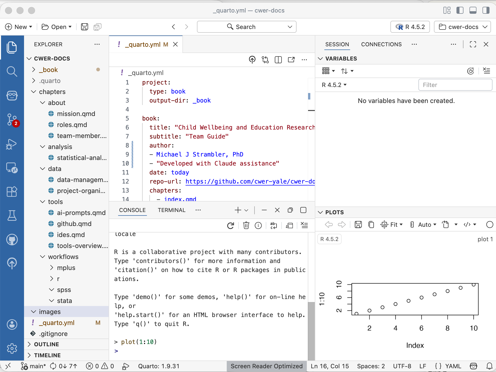
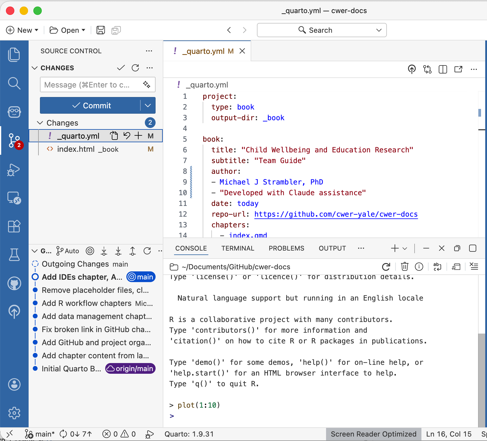

# IDEs

An IDE (Integrated Development Environment) is the application you use to write and run code. While you could write R or Stata code in a basic text editor, an IDE adds features that make the work significantly easier: syntax highlighting, error detection, an integrated console for running code interactively, file management, Git integration, and AI assistance. For most researchers, the IDE is where they spend the majority of their working time.

We recommend two IDEs: **Positron** for most team members, and **Cursor** for those who want deeper AI integration in their coding workflow.

## Positron

[Positron](https://positron.posit.co/) is developed by Posit, the same company that developed RStudio. It is designed specifically for data science work and has great support for R, Quarto documents, and the kinds of workflows CWER uses day to day. Positron is the successor to RStudio and is what new team members should install.

Key features relevant to CWER work:

- **R console** — run R code interactively, see output and plots inline
- **Variable explorer** — inspect objects in your R environment at a glance
- **Quarto support** — write, preview, and render `.qmd` documents natively
- **Git integration** — stage, commit, push, and pull from the Source Control panel without opening the terminal
- **Terminal** — access the command line directly within the application
- **Extension support** — install extensions to add functionality (see the Tools Overview chapter for recommended extensions)

Download Positron at [positron.posit.co](https://positron.posit.co/).

{fig-align="center" width="100%"}

### Getting Started in Positron

Positron works by opening a **folder** as your workspace rather than individual files. When you start working on a project, use **File → Open Folder** to open the project's root directory. All of Positron's tools — the file explorer, R console, terminal, and Git panel — will then work relative to that folder.

The main panels you will use:

- **Explorer** (left sidebar, top icon) — browse and open files in your project
- **Source Control** (left sidebar, branching icon) — Git operations: stage, commit, push, pull
- **Console** (bottom panel) — run R code interactively
- **Terminal** (bottom panel) — run shell commands
- **Plots** (right panel) — view figures produced by R

### Git in Positron

For day-to-day Git operations, the Source Control panel is the most convenient approach:

1. Make changes to your files
2. Click the **Source Control** icon in the left sidebar
3. Changed files appear under **Changes** — click the **+** next to each file to stage it, or click **+** next to **Changes** to stage all
4. Type a commit message in the box at the top
5. Click the **✓ Commit** button
6. Click the **Sync** button (or the push icon) to push to GitHub

{fig-align="center" width="100%"}

For pulling changes from teammates, click the **Sync** button or use the **...** menu and select **Pull**.

## Cursor

[Cursor](https://www.cursor.com/) is an IDE built on the same foundation as Positron and VS Code but with deeper AI integration woven throughout the editing experience. Where Positron treats AI as an add-on, Cursor builds AI assistance into the core of how you write code — it can suggest completions, edit code in response to natural language instructions, and answer questions about your codebase without leaving the editor.

Cursor is a good choice for team members who are doing substantial coding work and want AI assistance that feels more seamless than copying and pasting between an IDE and a chat interface. It supports R, works with Quarto documents, and has the same Git integration as Positron.

Key features that differentiate Cursor from Positron:

- **Inline AI editing** — highlight code and give natural language instructions to edit it in place (e.g., "refactor this to use tidyverse" or "add error handling here")
- **Chat with your codebase** — ask questions about your project's files and get answers that reference specific lines of code
- **AI autocomplete** — context-aware suggestions that go beyond standard autocomplete, drawing on the surrounding code and your project structure
- **Model choice** — use Claude, GPT-4, or other models depending on the task

Cursor is optional; Positron is sufficient for most CWER work. But for team members doing complex R or Stata workflows where AI assistance is a regular part of the process, Cursor can meaningfully reduce friction.

Download Cursor at [cursor.com](https://www.cursor.com/).

## Which Should I Use?

The choice is yours. For most CWER team members, **starting with Positron** may feel more natural, especially if you've experience with RStudio. It is purpose-built for data science, has excellent R and Quarto support, and is straightforward to learn. Once you are comfortable with your analysis workflows, consider trying Cursor if you find yourself frequently switching between your IDE and a chat interface for coding help.

Both IDEs are free. You can have both installed and switch between them as they work with the same files and Git repositories.